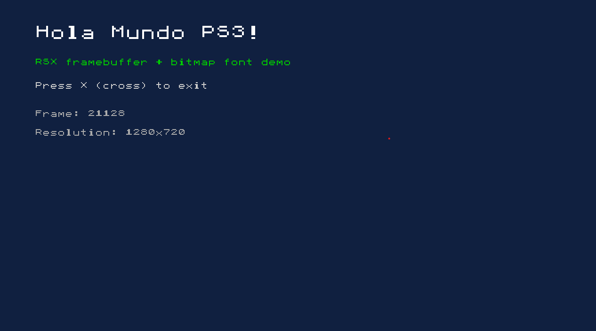

# Hola Mundo PS3

Aplicacion homebrew para **PlayStation 3** que muestra texto en pantalla usando el framebuffer del RSX y lee entrada del control DualShock 3. Compilada con [PSL1GHT](https://github.com/ps3dev/PSL1GHT) y [ps3toolchain](https://github.com/ps3dev/ps3toolchain).



## Que hace

- Inicializa el GPU (RSX) con doble buffer XRGB a la resolucion nativa de la consola
- Renderiza texto en pantalla usando una fuente bitmap 8x8 escalable directamente sobre el framebuffer
- Muestra un contador de frames y la resolucion activa
- Lee el estado del control via `ioPadGetData` y sale al presionar **X** (cross)
- Responde a eventos del sistema (salir desde el XMB)

## Compilar

Requiere [Docker](https://www.docker.com/). La imagen `flipacholas/ps3devextra` incluye el toolchain completo (`powerpc64-ps3-elf-gcc`, `sprxlinker`, `make_self`, etc.).

```bash
docker run --rm -v "$PWD:/src" flipacholas/ps3devextra:latest make -C /src/src
```

Esto genera:

| Archivo | Descripcion |
|---|---|
| `src/hello_world.elf` | Ejecutable ELF crudo (PPC64) |
| `src/hello_world.self` | SELF firmado (PS3 real con CFW/HEN) |
| `src/hello_world.fake.self` | Fake SELF (RPCS3) |

Para generar un `.pkg` instalable:

```bash
docker run --rm -v "$PWD:/src" flipacholas/ps3devextra:latest make -C /src/src pkg
```

Limpiar artefactos:

```bash
docker run --rm -v "$PWD:/src" flipacholas/ps3devextra:latest make -C /src/src clean
```

> En Windows con Git Bash, prefija los comandos con `MSYS_NO_PATHCONV=1` para evitar que `/src` se convierta a una ruta de Windows.

## Ejecutar en RPCS3

1. Descarga [RPCS3](https://rpcs3.net/download)
2. Instala el firmware: **File > Install Firmware** con el archivo `PS3UPDAT.PUP` de [PlayStation.com](https://www.playstation.com/en-us/support/hardware/ps3/system-software/)
3. **File > Boot SELF/ELF** y selecciona `src/hello_world.fake.self`

## Ejecutar en PS3 (CFW/HEN)

Transfiere `hello_world.self` a la PS3 via FTP o USB y ejecuta desde un file manager (multiMAN, webMAN). Si generaste el `.pkg`, instalalo desde **Juego > Package Manager > Install Package Files > Standard**.

## Librerias PSL1GHT utilizadas

| Libreria | Uso |
|---|---|
| `librsx` | Inicializacion RSX, asignacion de memoria de video, flush de comandos |
| `libgcm_sys` | Configuracion de display buffers, flip, sincronizacion GPU |
| `libio` | Lectura del control DualShock (pad) |
| `libsysutil` | Configuracion de video, callbacks del sistema (salir desde XMB) |
| `librt` | Runtime C de PSL1GHT (inicializa stdout/stderr sobre lv2 TTY) |
| `liblv2` | Syscalls de bajo nivel (`sysProcessExit`) |

## El procesador Cell Broadband Engine

El Cell BE es un procesador heterogeneo disenado por Sony, Toshiba e IBM para la PlayStation 3. Combina un nucleo de proposito general con multiples unidades de computo paralelo:

```
┌─────────────────────────────────────────────────┐
│              Cell Broadband Engine              │
│                                                 │
│  ┌─────────┐    ┌─────┐ ┌─────┐ ┌─────┐         │
│  │   PPU   │    │ SPE │ │ SPE │ │ SPE │         │
│  │ PowerPC │    │  0  │ │  1  │ │  2  │         │
│  │  64-bit │    │256KB│ │256KB│ │256KB│         │
│  └────┬────┘    └──┬──┘ └──┬──┘ └──┬──┘         │
│       │            │       │       │            │
│  ═════╪════════════╪═══════╪═══════╪════════════│
│       │     Element Interconnect Bus (EIB)      │
│  ═════╪════════════╪═══════╪═══════╪════════════│
│       │            │       │       │            │
│  ┌────┴────┐    ┌──┴──┐ ┌──┴──┐ ┌──┴──┐         │
│  │   MIC   │    │ SPE │ │ SPE │ │ SPE │         │
│  │ Memory  │    │  3  │ │  4  │ │  5  │         │
│  │Interface│    │256KB│ │256KB│ │256KB│         │
│  └─────────┘    └─────┘ └─────┘ └─────┘         │
└─────────────────────────────────────────────────┘
```

**PPU (PowerPC Processing Unit)** — Nucleo principal de 64 bits con dos hilos hardware (SMT). Ejecuta el sistema operativo y controla el flujo del programa. En homebrew, el PPU inicializa subsistemas (RSX, pads, SPUs) y coordina la logica principal.

**SPE (Synergistic Processing Element)** — 6 unidades de computo independientes (7 en el silicio, 1 deshabilitada por yield). Cada SPE tiene:
- **256 KB de Local Store**: memoria rapida y exclusiva (no es cache, es SRAM direccionable)
- **128 registros de 128 bits**: operaciones SIMD nativas sobre 4 floats, 8 shorts o 16 bytes en paralelo
- **MFC (Memory Flow Controller)**: motor DMA autonomo para transferencias asincronas entre Local Store y memoria principal

Los SPEs no acceden a RAM directamente. Toda comunicacion con el PPU se hace via DMA a traves del **EIB (Element Interconnect Bus)**, un bus en anillo de 204.8 GB/s de ancho de banda.

**RSX (Reality Synthesizer)** — GPU basado en la arquitectura NVIDIA G70 (similar a GeForce 7800). Tiene 256 MB de GDDR3 dedicados y acceso a los 256 MB de XDR RAM del sistema via FlexIO. En este proyecto se usa para el framebuffer de video con doble buffer y flip sincronizado a VSYNC.

## Licencia

Uso libre con fines educativos.
